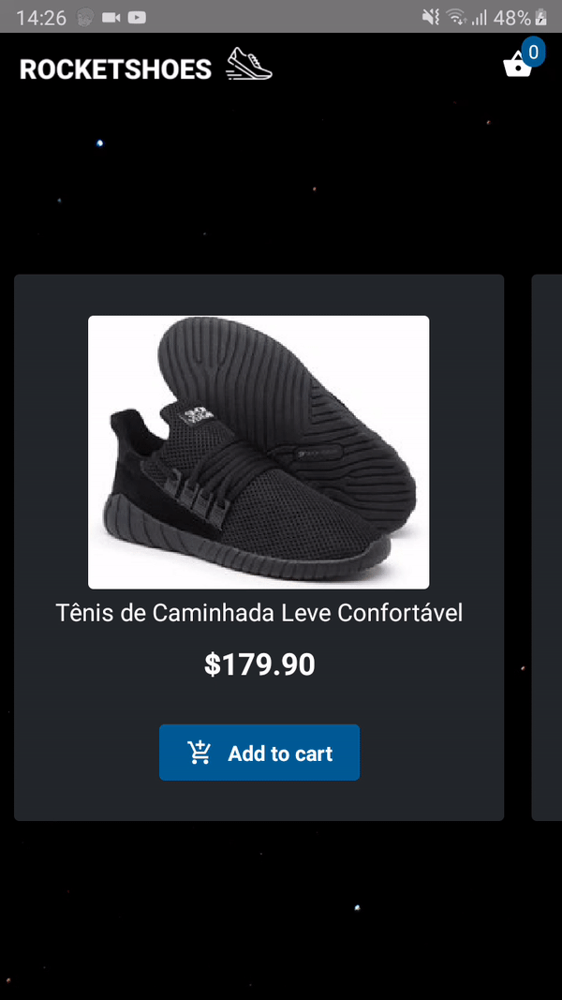

# Rocketshoes :athletic_shoe: :rocket: @Rocketseat <a href="https://github.com/Felibread/rocketshoes-web">Challenge 07</a>

Project created to reenforce my knowledge about Redux and Redux Saga by making the mobile for <a href="https://github.com/Felibread/rocketshoes-web">Rocketshoes Web</a>



## Run this project

**Install the dependencies**

Yarn
```bash
yarn
```

---

Npm
```bash
npm install
```
---
**Start the Json Server**

```bash
 yarn json-server server.json -p 3333
```
---
**Start the Metro Bundler**

```bash
react-native start
```
---
**Start the App**

```bash
react-native run-android
```

**OR**

```bash
react-native run-ios
```
